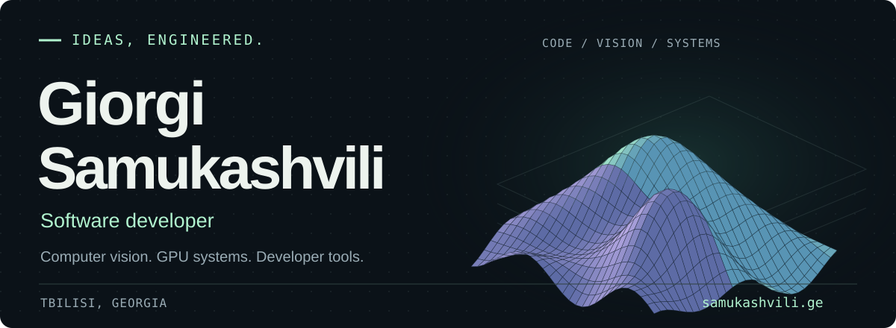
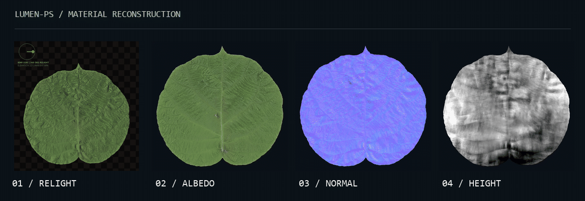
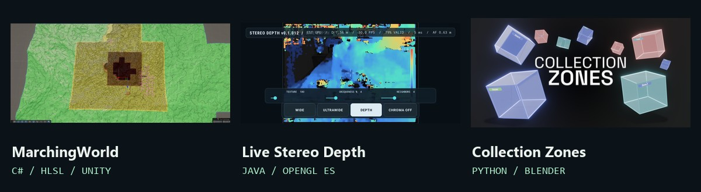

<a href="https://samukashvili.ge/">
  <picture>
    <source media="(max-width: 600px)" srcset="assets/header-mobile.svg">
    
  </picture>
</a>

  <a href="https://samukashvili.ge/"><strong>Portfolio</strong></a> &nbsp;·&nbsp;
  <a href="https://samukashvili.ge/products.html"><strong>Tools &amp; projects</strong></a> &nbsp;·&nbsp;
  <a href="https://github.com/Samukashvili?tab=repositories"><strong>Open source</strong></a> &nbsp;·&nbsp;
  <a href="mailto:gsamukashvili0@gmail.com"><strong>Get in touch ↗</strong></a>

### I turn complex problems into useful software.

I'm **Giorgi**, a developer and computer science student based in **Tbilisi, Georgia**. I build software across **computer vision, real-time graphics, procedural systems, and automation** — from reconstructing materials with a flatbed scanner to streaming terrain on the GPU.

My technical-art background shapes the tools I build: practical workflows, interactive feedback, and performance that holds up on real devices.

 

## 01 / Featured — LUMEN-PS

### Four scans. A relightable material.

**[LUMEN-PS](https://github.com/Samukashvili/LUMEN-PS)** turns an ordinary flatbed scanner into a photometric-stereo material scanner. Rotate the subject between four captures; recover **normal, albedo, roughness, height, and alpha** maps from the lighting differences.

<a href="https://github.com/Samukashvili/LUMEN-PS">
  <picture>
    <source media="(max-width: 600px) and (prefers-reduced-motion: reduce)" srcset="assets/lumen-showcase-mobile.jpg">
    <source media="(prefers-reduced-motion: reduce)" srcset="assets/lumen-showcase.jpg">
    <source media="(max-width: 600px)" srcset="assets/lumen-showcase-mobile.gif">
    
  </picture>
</a>

Real 1200 dpi kiwi leaf reconstruction. The animation is lit using the recovered normal map.

Built with **Python / CUDA**, with a Windows app and CLI, rigid and non-rigid registration, robust reconstruction, matched material atlases, and re-rendered quality checks.

**[Explore the repository ↗](https://github.com/Samukashvili/LUMEN-PS)** &nbsp;·&nbsp; [See the walkthrough](https://samukashvili.ge/products/lumen-ps.html) &nbsp;·&nbsp; [Read the documentation](https://samukashvili.ge/products/lumen-ps-docs.html)

 

## 02 / Systems & developer tools

<a href="https://samukashvili.ge/products.html">
  <picture>
    <source media="(max-width: 600px)" srcset="assets/products-mobile.jpg">
    
  </picture>
</a>

#### [WebGL SceneBuilder ↗](https://samukashvili.ge/products/webgl-scenebuilder.html)

**TypeScript · WebGL · In development**  
A desktop editor for assembling, lighting, and optimizing 3D scenes, then exporting self-contained WebGL bundles ready to embed in websites.

#### [MarchingWorld ↗](https://samukashvili.ge/products/marchingworld.html)

**Unity · C# · HLSL · In development**  
GPU-first Surface Nets terrain: deterministic hills and caves, seamless octree LOD transitions, and asynchronously baked physics. Transition topology is prepared during generation so LOD changes can reuse retained meshes.

#### [Live Stereo Depth ↗](https://samukashvili.ge/products/stereo-depth.html)

**Android · Java · OpenGL ES 3.1 · Research prototype**  
Live metric depth from concurrent wide and ultrawide camera streams. Compute shaders handle rectification, census matching, four-path SGM, and filtering; buffered readback overlaps GPU work with camera capture.

#### [Collection Zones ↗](https://samukashvili.ge/products/collection-zones.html)

**Blender · Python**  
A spatial organization add-on that assigns objects to collections by position, with manual zones, world grids, exclusions, fallback collections, and movement tracking.

 

## 03 / More open-source experiments

- **[LaunchPoint](https://github.com/Samukashvili/LaunchPoint)** — Monte Carlo viewshed intersection on real terrain, estimating a drone operator's location from sightings. `Python`
- **[VoiceReady](https://github.com/Samukashvili/VoiceReady)** — a voice-command assistant for Ready or Not, combining read-only game-state detection with input emulation. `C#`
- **[RC-N1 Controller Bridge](https://github.com/Samukashvili/RC-N1_ControllerBridge)** — turns a DJI RC-N1 remote into a low-latency virtual Xbox 360 controller for simulators and games. `Python`

 

## 04 / My toolkit

**Languages** &nbsp; Python · TypeScript · C# · Java · HLSL  
**Platforms** &nbsp; CUDA · WebGL · OpenGL ES · Unity · Android · Blender  
**Focus** &nbsp; Computer vision · GPU programming · Procedural systems · Developer tools · Automation

---

Interested in computer vision, real-time systems, or creative software? **[Let's talk ↗](mailto:gsamukashvili0@gmail.com)**

More work, demos, and free texture utilities at <a href="https://samukashvili.ge/">samukashvili.ge</a>.
